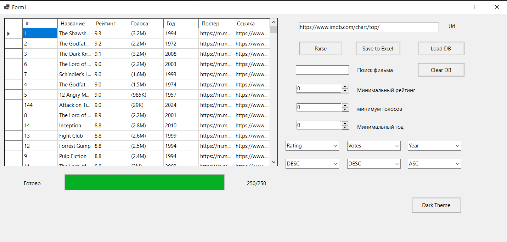
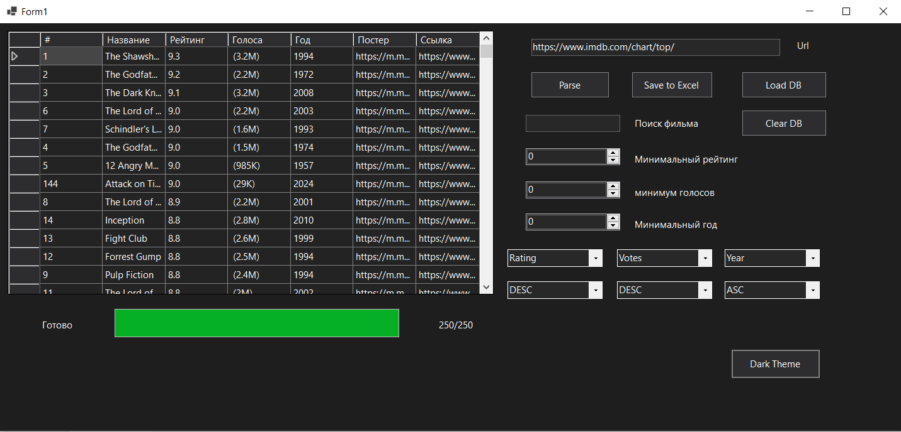
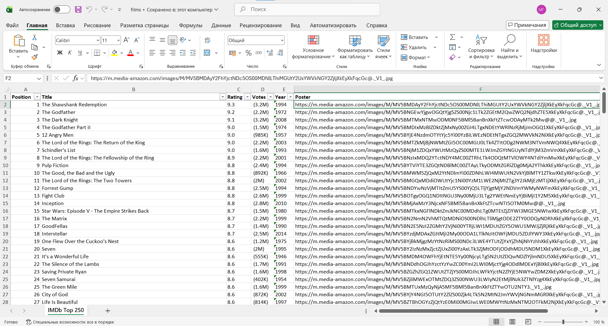

# IMDb Top 250 Scraper 🎬


Desktop application built with **C# WinForms** for scraping and managing IMDb Top 250 movies.  
Supports **web scraping, filtering, sorting, SQLite storage, Excel export, and dark/light theme UI**.

---

## 📸 Preview

### Main Window


### Dark Theme


### Excel Export


---

## ✨ Features

✔ Parse **IMDb Top 250** movies from URL  
✔ Display movies in `DataGridView`  
✔ Search by title  
✔ Filter by:

- minimum rating
- vote count
- release year

✔ Multi-level sorting (up to 3 fields)  
✔ Save movies into **SQLite database**  
✔ Load / clear database  
✔ Export to **Excel (.xlsx)**  
✔ Light / Dark theme switching

---

## 🛠 Tech Stack

| Technology | Purpose |
|---|---|
| **C# / .NET 10** | Application logic |
| **WinForms** | Desktop UI |
| **Playwright** | IMDb scraping |
| **SQLite-net** | Local database |
| **ClosedXML** | Excel export |
| **LINQ** | Filtering & sorting |

---

## 🚀 Demo Workflow

```text
IMDb URL
   ↓
Parse movies
   ↓
Display in DataGridView
   ↓
Filter / Sort
   ↓
Save to SQLite
   ↓
Export to Excel
```

---

## 🏗 Project Structure

```text
IMDbTop250Scraper/
│
├── Models/
│   └── Movie.cs
│
├── Services/
│   ├── ImdbParserService.cs
│   ├── DatabaseService.cs
│   └── ExcelExportService.cs
│
├── Helpers/
│   └── ThemeHelper.cs
│
├── Form1.cs
├── Program.cs
└── movies.db
```

---

## 💡 What I implemented

This project demonstrates practical skills in:

- **Web scraping** with Playwright
- Working with **SQLite databases**
- Desktop UI development in **WinForms**
- **Excel file generation**
- Theme customization (**Dark / Light mode**)
- Data filtering and sorting using **LINQ**
- Organizing code into **Models / Services / Helpers**

---

## 📊 Movie Model

Each movie contains:

| Field | Example |
|---|---|
| Position | 1 |
| Title | The Shawshank Redemption |
| Rating | 9.3 |
| VoteCount | 3,000,000 |
| Year | 1994 |
| Poster | Image URL |
| Link | IMDb URL |

---

## ⚡ Installation

### Clone repository

```bash
git clone https://github.com/username/IMDbTop250Scraper.git
```

### Open in Visual Studio

Open:

```text
IMDbTop250Scraper.sln
```

### Install NuGet packages

```powershell
Install-Package Microsoft.Playwright
Install-Package sqlite-net-pcl
Install-Package ClosedXML
```

### Install Playwright browsers

```bash
playwright install
```

### Run project

Press:

```text
F5
```

---

## 🎯 Key Learning Outcomes

During this project I practiced:

- Building desktop applications with **WinForms**
- Parsing dynamic websites
- Working with relational local databases
- Exporting structured data to Excel
- Creating reusable service-based architecture
- UI theming and user experience improvements

---

## 📌 Future Improvements

- Add async loading with progress bar
- Save user settings
- Charts/statistics dashboard
- Movie poster preview
- Pagination support
- Search history

---

## 👨‍💻 Author

**Nikita**  
Junior C# / .NET Developer

GitHub: https://github.com/yourusername

---

## 📄 License

MIT License
